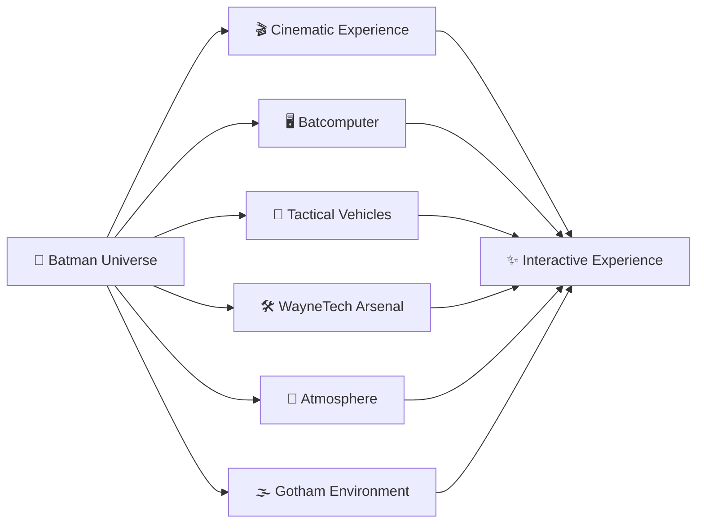
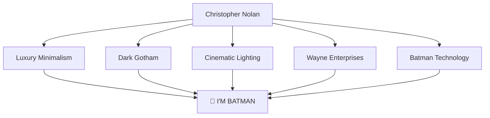
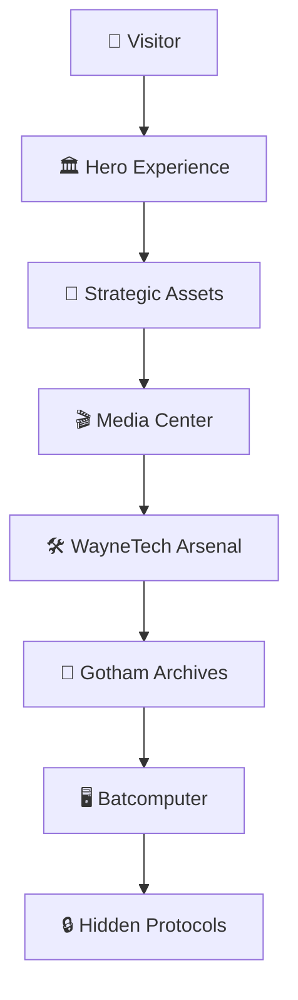
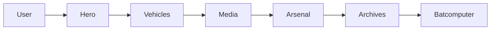
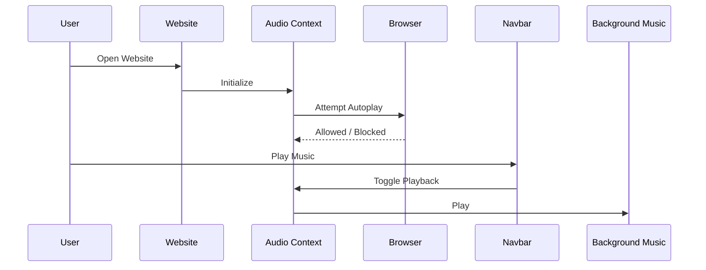

<div align="center">

<pre>
██████╗  █████╗ ████████╗███╗   ███╗ █████╗ ███╗   ██╗
██╔══██╗██╔══██╗╚══██╔══╝████╗ ████║██╔══██╗████╗  ██║
██████╔╝███████║   ██║   ██╔████╔██║███████║██╔██╗ ██║
██╔══██╗██╔══██║   ██║   ██║╚██╔╝██║██╔══██║██║╚██╗██║
██████╔╝██║  ██║   ██║   ██║ ╚═╝ ██║██║  ██║██║ ╚████║
╚═════╝ ╚═╝  ╚═╝   ╚═╝   ╚═╝     ╚═╝╚═╝  ╚═╝╚═╝  ╚═══╝
</pre>

<br>

<br><br>

<br><br>


<br><br>

<a href="YOUR_LIVE_DEMO">

</a>

<a href="https://github.com/Dark-Vinaal/I-m-Batman">

</a>

</div>

<div align="center">  </div>

## 🦇 I'M BATMAN

> **"It's Not who I am Underneath, But What I do that Defines Me."**

**Project Batman** is a cinematic Batman-inspired web experience built with **React**, **TypeScript**, **Vite**, **Tailwind CSS**, and **Framer Motion**.

Instead of creating a traditional fan page, this project recreates the feeling of entering **Wayne Enterprises**, accessing the **Batcomputer**, exploring Gotham's tactical archives, discovering legendary vehicles, and interacting with an immersive luxury interface inspired by Christopher Nolan's Batman universe.

Every section is designed with cinematic transitions, ambient effects, luxury minimalism, and interactive storytelling.

<div align="center">  </div>

## ⚡ Mission Brief

```txt
PROJECT NAME      : I'M BATMAN
CLASSIFICATION    : WAYNE ENTERPRISES
STATUS            : ACTIVE
CLEARANCE LEVEL   : VII
LOCATION          : BATCAVE
PRIMARY LANGUAGE  : TypeScript
FRAMEWORK         : React
MISSION           : Protect Gotham
```

<div align="center">  </div>

## 🌌 Project Vision



<div align="center">  </div>

## ✨ Highlights

| 🦇 | Feature |
|----|---------|
| 🎬 | Cinematic Landing Page |
| 💻 | Fully Interactive Batcomputer |
| 🚗 | Batman Vehicle Showcase |
| 🛠 | WayneTech Arsenal |
| 🌫 | Fog, Film Grain & Ambient Effects |
| 🎵 | Background Music Player |
| 🖱 | Custom Cursor |
| 🎞 | Batman Trailers & Media |
| 🎭 | Luxury Gotham UI |
| 🎮 | Hidden Easter Eggs |
| ⚡ | Smooth Framer Motion Animations |
| 📱 | Responsive Design |

<div align="center">  </div>

## 🎨 Design Philosophy



<div align="center">  </div>

## 📸 Experience

This isn't a simple website.

It's an interactive Batman experience featuring:

- 🦇 Gotham atmosphere
- 🎬 cinematic storytelling
- 🌫 dynamic ambient effects
- 🎵 immersive soundtrack
- 💻 Batcomputer simulation
- 🚗 tactical vehicles
- 🛠 WayneTech gadgets
- 🎞 official trailers
- 📂 archives
- 🖱 custom cursor
- 🎭 luxury UI

Every scroll reveals another chapter inside the Batcave.

<div align="center">  </div>

## 🏗 Wayne Enterprises Architecture



<div align="center">  </div>

## ⚙ Tech Stack

<div align="center">

| Category | Technologies |
|-----------|--------------|
| ⚛ Framework | React 19 |
| 🔷 Language | TypeScript |
| ⚡ Build Tool | Vite |
| 🎨 Styling | Tailwind CSS v4 |
| 🎞 Animation | Framer Motion |
| 🌌 3D Graphics | React Three Fiber |
| ✨ Effects | Post Processing Bloom |
| 🎵 Audio | HTML5 Audio API |
| 📦 Package Manager | npm |

</div>

<div align="center">  </div>

## 📦 Project Structure

```txt
📦 I'm Batman
│
├── 📂 public
│   ├── 🦇 favicon
│   ├── 🖼 assets
│   └── 🎵 media
│
├── 📂 src
│   │
│   ├── 🧩 components
│   │   ├── Hero
│   │   ├── Navbar
│   │   ├── Vehicles
│   │   ├── Arsenal
│   │   ├── Archives
│   │   ├── MediaSection
│   │   ├── BatComputer
│   │   ├── Dialogue
│   │   ├── Cursor
│   │   ├── Ambient
│   │   └── FloatingDialogues
│   │
│   ├── 🎧 context
│   ├── 🪝 hooks
│   ├── 🎨 styles
│   ├── 📄 App.tsx
│   └── 🚀 main.tsx
│
├── ⚙ assets
├── 📄 README.md
└── 📜 LICENSE
```

<div align="center">  </div>

## 🖥 System Overview



<div align="center">  </div>

## 🎨 Interface Design

The interface follows a luxury Gotham-inspired design language.

### Core Principles

- 🦇 Matte black backgrounds
- ✨ Cyan holographic lighting
- 🪞 Glassmorphism panels
- 🌫 Film grain overlays
- 🎬 Cinematic typography
- 💡 Soft bloom lighting
- 🖥 HUD inspired UI
- ⚡ Smooth transitions

<div align="center">  </div>

## 🎬 Hero Experience

The homepage immediately places visitors inside Gotham through a cinematic fullscreen hero section.

### Includes

- 🎥 Bruce Wayne background video
- 🦇 Large luxury typography
- 🌫 Dynamic spotlight lighting
- 🎞 Animated entry
- 🎯 Enter The Batcave CTA
- ⚡ Smooth page transition

<div align="center">  </div>

## 🚗 Strategic Assets

The Bat Garage showcases legendary Batman vehicles.

| Vehicle | Status |
|----------|--------|
| 🦇 Batmobile | Operational |
| 🏍 Batcycle | Operational |
| ✈ Batwing | Operational |
| 🦇 Batman | Classified |

Each vehicle features:

- cinematic cards
- hover animations
- tactical specifications
- Gotham quotes

<div align="center">  </div>

## 🛠 WayneTech Arsenal

The Arsenal introduces futuristic equipment engineered by Wayne Enterprises.

### Equipment

🛡 Nano Gadget

⚙ Kinetic Suit

💻 Tactical HUD

Every card features

- hover zoom
- luxury glass UI
- animated transitions
- cinematic layout

<div align="center">  </div>

## 🎞 Media Center

The Media section acts as Gotham's cinematic archive.

### Includes

🎬 Movie Clips

🎵 Batman Theme

📺 Official Trailers

🔦 Interactive Spotlight Reveal

🌐 Official DC Link

<div align="center">  </div>

## ⚡ Performance

✔ Optimized React Components

✔ Lazy Rendered Sections

✔ GPU Accelerated Animations

✔ Responsive Layout

✔ Lightweight Build

✔ Modern Browser Support

✔ Smooth Scrolling

✔ High FPS Animations

<div align="center">  </div>

## 🖥 Wayne Enterprises Command Center

The **Batcomputer** serves as the digital heart of the entire experience.

Inspired by Batman's command center from various cinematic universes, it provides an immersive futuristic dashboard with animated logs, tactical scanning systems, rotating HUD elements, live metrics and classified archives.

<div align="center">  </div>

## 💻 Batcomputer Features

<div align="center">

| 🦇 Module | Description |
|-----------|-------------|
| 🧠 Neural Stream | Animated system logs |
| 🛰 Tactical Scanner | Rotating holographic HUD |
| 📊 Live Metrics | Dynamic status panels |
| 💬 Quote Engine | Rotating Batman quotes |
| ⚡ Overlay Mode | Secret fullscreen Batcomputer |
| 🎞 Smooth Motion | Framer Motion powered |

</div>

<div align="center">  </div>

## 🎵 Wayne Audio Engine

The experience isn't complete without sound.

The website includes a dedicated audio system capable of playing ambient Batman music while allowing visitors to control playback without interrupting the experience.

### Features

🎵 Background Theme

🔊 Play / Pause

🔇 Mute

🔁 Loop Playback

⚡ React Context API

🎧 HTML5 Audio

### Audio Workflow



<div align="center">  </div>

## 🖱 Custom Cursor

A custom Batman cursor replaces the default pointer throughout the project.

### Features

✔ Dynamic Movement

✔ Glow Effect

✔ Hover Detection

✔ Context Awareness

✔ Motion Animation

✔ Luxury Feel

<div align="center">  </div>

## 🎬 Animation System

Every animation is handcrafted using **Framer Motion**.

Animations include

- Page transitions

- Hero reveal

- Scroll animations

- Hover interactions

- Quote fading

- Batcomputer transitions

- Overlay effects

- Section reveal

<div align="center">  </div>

## 🎥 Cinematic Experience

Rather than functioning as a standard portfolio or fan page, the project is structured like a cinematic journey.

<div align="center">  </div>

## 📡 Tactical Systems

<div align="center">

| MODULE | STATUS |
|--------|--------|
| 🖥 BATCOMPUTER | 🟢 ONLINE |
| 🚗 BATMOBILE | 🟢 READY |
| ✈ BATWING | 🟢 READY |
| 🛰 SATELLITE | 🟢 CONNECTED |
| 🛡 DEFENSE GRID | 🟢 ACTIVE |
| 🎵 AUDIO ENGINE | 🟢 RUNNING |
| 🎬 CINEMATIC ENGINE | 🟢 RUNNING |
| 🦇 GOTHAM SURVEILLANCE | 🟢 ONLINE |

</div>

<div align="center">  </div>

## 🧩 Developer Notes

This project was built as both

- a tribute to `Batman`

and

- an exploration of modern UI engineering.

The goal wasn't simply to display Batman content—

it was to make visitors **feel like they had entered the Batcave.**

<div align="center">  </div>

## 👨‍💻 Developer

<div align="center">

### Vinaal R

Creative Developer • Full Stack Developer • UI Explorer

<br>

<a href="https://github.com/Dark-Vinaal">

</a>

<a href="https://www.linkedin.com/in/vinaal">

</a>

<br><br>


</div>

<div align="center">  </div>

## ⭐ Support

If you enjoyed exploring Gotham and the Batcomputer,

> Consider giving this repository a ⭐ Every star helps the project reach more Batman fans and developers.

<div align="center">

<pre>
MISSION STATUS

█████████████████████ 100%
</pre>

## 🦇

#### "It's not who I am underneath, but what I do that defines me."


</div>
